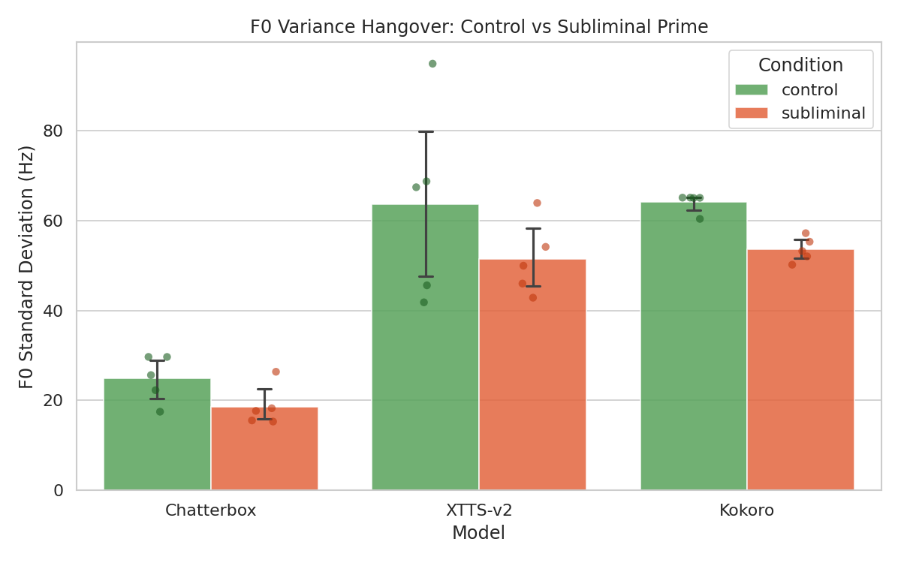

# _7 Subliminal Hangover

Does a monotone/robotic prime suppress pitch variance in a subsequent emotional target sentence? If TTS context windows carry acoustic prosody forward, a flat number-reading prime should "bleed" into the next sentence, compressing pitch variation.

## Hypothesis

If **nouns > numbers** on f0_cv (pitch coefficient of variation) while speaking rate stays flat, the hangover is real acoustic inertia, not a tempo confound.

The length-matched noun condition (`Apple, bridge, window, carpet, ...`) isolates the effect from "time-on-task" and attention drift that plagued the original short nature-sentence control.

## Design

3 conditions per model, 5 repetitions each (5 shuffled prime variants per condition). 45 WAVs total. Single emotional target sentence.

```
control:     "The sun was shining brightly on the beautiful, warm meadow today."
             -> "You absolutely cannot be serious about this ridiculous idea!"

noun:        "Apple, bridge, window, carpet, ..." (14 nouns, 5 shuffled variants)
             -> same target

subliminal:  "847, 912, 55, 104, ..." (14 numbers, 5 shuffled variants)
             -> same target
```

Primes and target are generated as a single string in one context window. Target extraction uses **WhisperX word alignment** (V3), guaranteeing the same text is measured every time.

## Result



| Model | f0_cv drop | p | Rate stable | Verdict |
|-------|-----------|----|-------------|---------|
| **Chatterbox** | -39% | 0.031 | yes | Pilot evidence |
| **XTTS-v2** | -29% | 0.094 | yes | Strong trend |
| **Kokoro** | -13% | 0.22 | borderline | Inconclusive |

Chatterbox shows a clean, significant hangover effect with rigorous controls (WhisperX alignment, length-matched baseline, f0_cv normalization). Two distinct phenotypes emerged: **pitch compression** (Chatterbox, XTTS-v2) and **tempo acceleration** (Kokoro borderline).

Full details in `results/report.pdf`.

## Models

| Model | Venv | Voice |
|-------|------|-------|
| Chatterbox | `venvs/py312` | VCTK p229_002 |
| Kokoro | `venvs/py312` | `af_bella` (no cloning) |
| XTTS-v2 | `venvs/py310` | VCTK p229_002 |

## Folder Structure

```
_7-subliminal-hangover/
├── prompts/
│   └── texts.json              # All prime/target text variants
├── scripts/
│   ├── generate_chatterbox.py  # Audio generation
│   ├── generate_kokoro.py
│   ├── generate_xtts.py
│   ├── gate_check.py           # Minimum viability
│   ├── extract_features.py     # parselmouth + librosa features
│   ├── analyze.py              # Wilcoxon signed-rank tests
│   ├── plot_figures.py         # f0_cv + speaking rate figure
│   └── make_report.py          # HTML + PDF report
├── outputs/
│   ├── chatterbox/             # 15 WAVs (3 conditions x 5 runs)
│   ├── kokoro/                 # 15 WAVs
│   └── xtts/                   # 15 WAVs
├── features/
│   └── features.csv            # 45 rows of extracted metrics
├── results/
│   ├── gate_check.json         # Gate pass/fail
│   ├── alignment_log.json      # WhisperX alignment results
│   ├── stats.json              # Wilcoxon test results
│   ├── f0_variance_hangover.png # Primary figure
│   ├── report.html             # Self-contained HTML report
│   └── report.pdf              # PDF report
└── README.md
```

## Pipeline Evolution

| Version | Segmentation | Control | Primary metric | Target |
|---------|-------------|---------|----------------|--------|
| V1 | VAD pause detection | Short nature sentence | f0_std | Two clauses |
| V2 | VAD pause detection | Length-matched nouns | f0_std | Two clauses |
| **V3** | **WhisperX word alignment** | **Length-matched nouns** | **f0_cv** | **Single clause** |

## Measured Features

| Metric | Tool | Captures |
|--------|------|----------|
| f0_cv (primary) | parselmouth (Praat) | Pitch modulation normalized: f0_std / f0_mean |
| f0_mean | parselmouth | Average pitch |
| f0_std | parselmouth | Raw pitch variance |
| Speaking rate | 18 syllables / aligned duration | Tempo (control metric) |
| Energy std | librosa RMS | Dynamic range |

## How to Run

```bash
cd _7-subliminal-hangover

# Generate audio (each in its own venv)
../venvs/py312/bin/python scripts/generate_chatterbox.py
../venvs/py312/bin/python scripts/generate_kokoro.py
../venvs/py310/bin/python scripts/generate_xtts.py

# Gate check
../venvs/py312/bin/python scripts/gate_check.py

# Extract features
../venvs/py312/bin/python scripts/extract_features.py

# Analyze
../venvs/py312/bin/python scripts/analyze.py

# Figures + report
../venvs/py312/bin/python scripts/plot_figures.py
../venvs/py312/bin/python scripts/make_report.py
```

## Notes

- Chatterbox `exaggeration=0.5` fixed across all runs.
- Kokoro uses `af_bella` voice preset; no voice cloning available.
- XTTS-v2 internal sentence splitting may reduce context window bleed.
- WhisperX alignment: 44/45 files aligned successfully.
- WAV files are **not tracked in git** (large binary artifacts).
- Statistical tests are descriptive (n=5), not confirmatory population-level inference.
